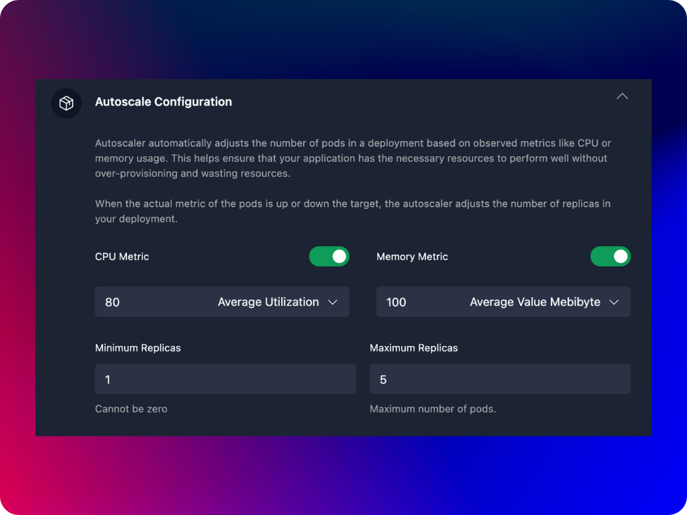

Autoscaling in Agnost allows your containers (specifically, your Deployments) to automatically adjust the number of running pods based on resource usage, such as CPU or memory. This helps ensure that your container has enough resources to handle varying workloads while optimizing resource usage and costs.

:::note
To use the autoscaling based on CPU and memory metrics, you need to have the [Metrics Server](https://kubernetes-sigs.github.io/metrics-server/) installed in your Kubernetes cluster. The Metrics Server collects resource usage data (like CPU and memory) from each node in the cluster and makes this data available to the HPA. Without the Metrics Server, Kubernetes won’t be able to gather the necessary metrics to make scaling decisions, and autoscaling won’t function.
:::

