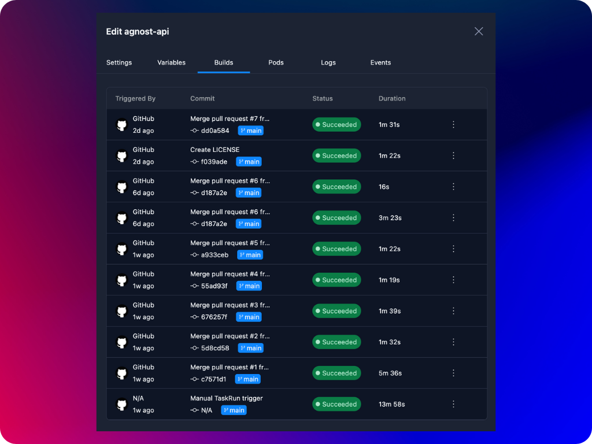
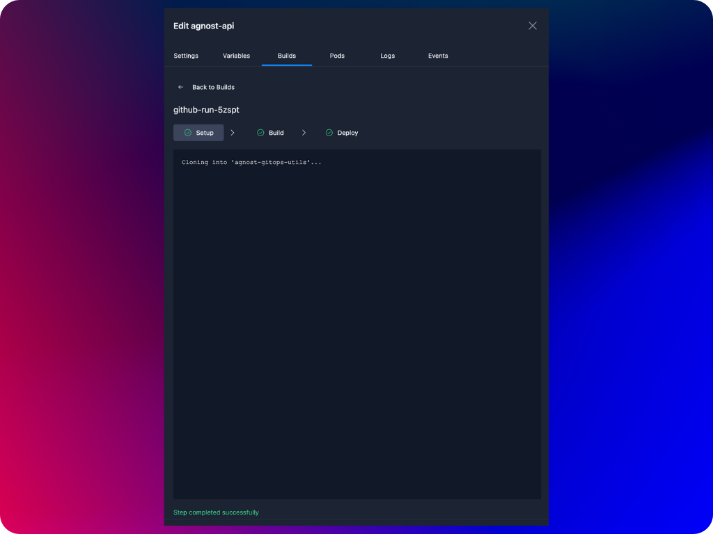
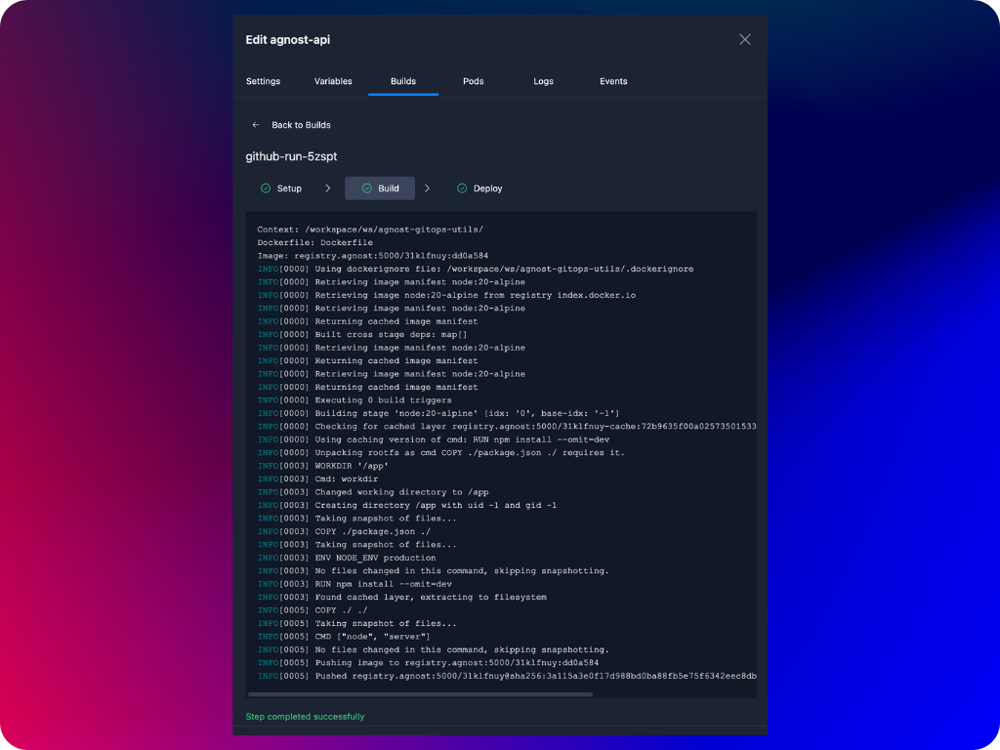
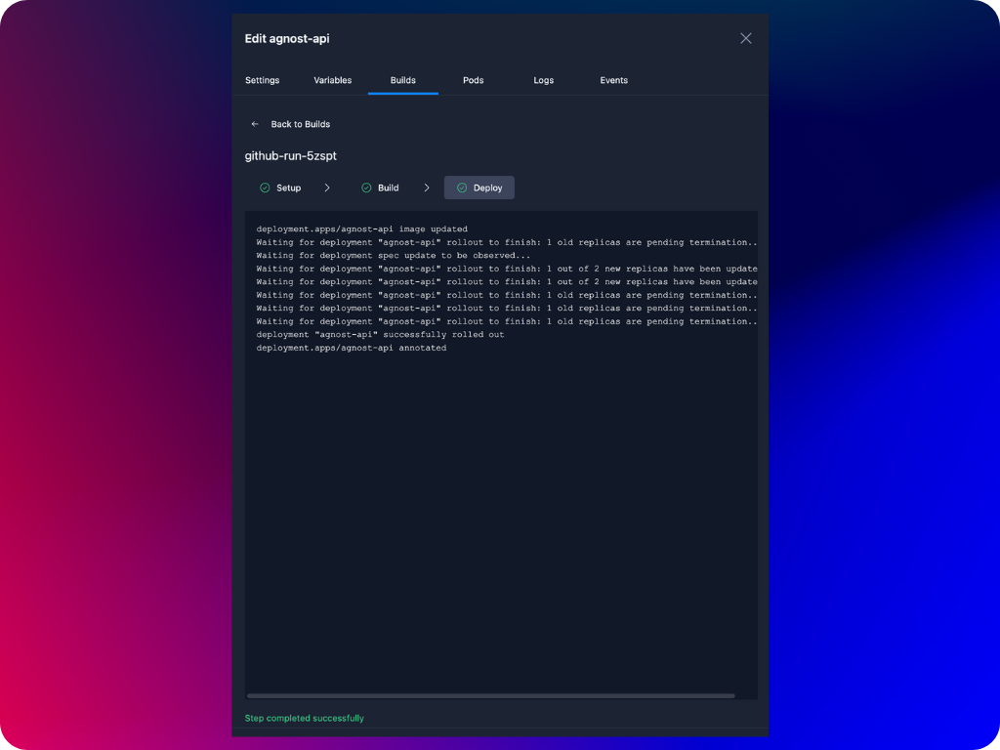
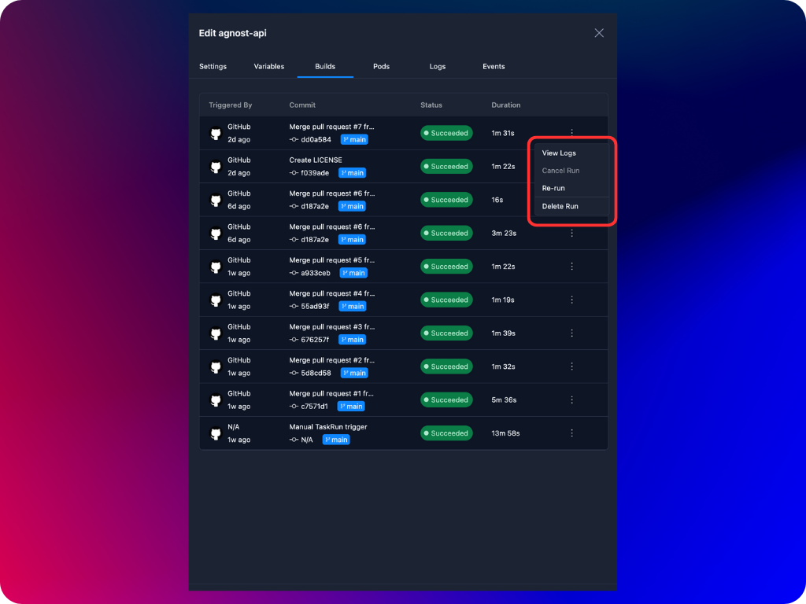

Agnost integrates seamlessly with GitHub, GitLab, and Bitbucket repositories to automate the process of building and deploying Docker images in a Kubernetes environment. The platform is designed to simplify the Continuous Integration and Continuous Deployment (CI/CD) process by allowing users to track and monitor each stage of their build and deployment pipelines.

When a push event is triggered in your repository, the platform initiates a pipeline with three primary steps:
1. Setup
2. Build
3. Deploy

Each step is crucial in transforming your codebase into a running service in your Kubernetes cluster. You can view the buid runs of your containers from the **Build** tab of your container properties.

## 1. Setup
In the Setup step, the platform clones your Git repository into the Kubernetes environment. This cloned repository serves as the foundation for the subsequent build and deployment processes.

What happens during Setup?
- The platform uses the repository URL provided during webhook registration.
- The platform clones the latest commit from the branch that triggered the push event.
- A working directory is established in the Kubernetes pod where the build process will occur.

## 2. Build
In the Build step, the platform uses the cloned repository to build an OCI-compliant Docker image. This process leverages Kaniko, a tool designed for building container images from a Dockerfile inside a Kubernetes cluster.

:::note
Agnost keeps the last 5 successful image builds in local registry and deletes older image tags to preserve storage space.
:::

What happens during Build?
- The platform reads the Dockerfile present in the cloned repository.
- Kaniko builds the Docker image according to the instructions in the Dockerfile.
- The built image is tagged appropriately and pushed to a Docker registry hosted within the same Kubernetes cluster.

## 3. Deploy
In the Deploy step, the platform uses the Docker image created in the previous step to update the deployment in your Kubernetes cluster.

What happens during Deploy?
- The platform identifies the deployment in the Kubernetes cluster associated with your project and environment.
- It updates the deployment's container image to the newly built and tagged Docker image.
- The Kubernetes deployment is rolled out, ensuring that your application is updated with the latest changes from your repository.

## Monitoring Pipeline Progress
Throughout the entire process, you can monitor the progress of each step via the user interface. The interface provides real-time logs and status indicators, allowing you to:

- **View Logs:** Access detailed logs for each step to identify any issues or errors.
- **Track Progress:** Monitor the success or failure of each step in the pipeline.
- **Debug Issues:** Use the logs to troubleshoot and resolve any problems that may arise during the pipeline execution.

## Managing Build & Deploy Runs
In addition to monitoring and troubleshooting your build and deploy pipelines, Agnost also provides several management options to give you greater control over your CI/CD process. These options are accessible directly from the **Build** tab of your containers, allowing you to easily manage your build runs.
1. Re-run a Build Run: If you need to re-run a build run—for example, after fixing an issue or updating your repository—you can do so with just a few clicks.
2. Cancel a Currently Running Build Run: If a build run is taking longer than expected or you realize that the current build should not proceed, you have the option to cancel it.
3. Delete a Build Run: To maintain a clean build history, or if a build run is no longer relevant, you can delete it from the history.

:::note
Agnost keeps the build run history for the last 7 days and deletes all build runs that are older to manage cluster resources more effectively.
:::

