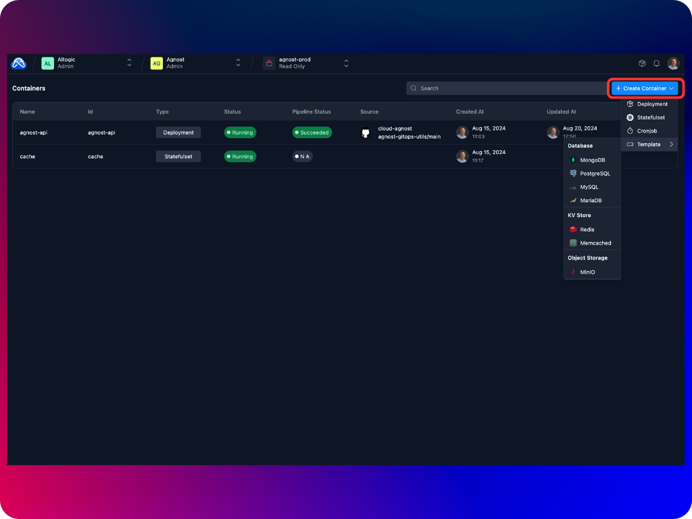
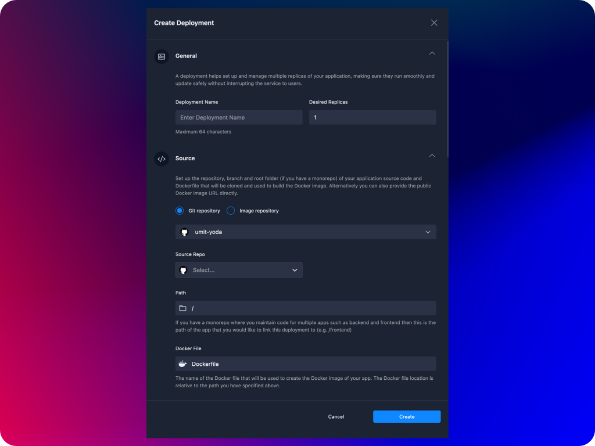

A container can be a Kubernetes [deployment](https://kubernetes.io/docs/concepts/workloads/controllers/deployment/), [stateful set](https://kubernetes.io/docs/concepts/workloads/controllers/statefulset/) or [cron job](https://kubernetes.io/docs/concepts/workloads/controllers/cron-jobs/). You create your containers in project environments and an environment can host multiple containers. Agnost also provides a list of templates that you can use when creating your containers.

:::note
When you create a database, key-value store or object storage using an Agnost template you can retrieve the username and password credentials to access these resource from the [environment variables](./variables) tab of the container.
:::

## Deployments
Deployment is a higher-level abstraction that manages the deployment and scaling of a set of pods, typically running a single containerized application. A deployment provides declarative updates to applications, meaning you describe the desired state of your application (such as the number of replicas, the container image version, etc.), and Kubernetes ensures that the actual state matches your desired state over time. 
- Deployments enable **rolling updates**, allowing you to update the application version or configuration without downtime. Kubernetes will gradually replace old pods with new ones, ensuring that the service remains available during the update process.
- Deployments allow you to **easily scale your application up or down** by adjusting the number of replicas in the deployment configuration. You can easily specify the rules in terms of memory and CPU consumption to autoscale the number of pods managed by a deployment.
- **Deployments can also self-heal.** Kubernetes monitors the pods in a deployment. If a pod fails or becomes unresponsive, Kubernetes will automatically replace it to maintain the desired state. You can configure start up, readiness and liveness probes which periodically check heartbeat of your deployment pods.
-  You can define **detailed configuration parameters** how the deployment should be created. The configuration parameters includes details such as the container image or conncted git repository, environment variables, ports, ingress, TCP proxy, custom domain and storage settings.

## Stateful Sets
In Kubernetes stateful sets manage the deployment and scaling of a set of pods, and provides guarantees about the ordering and uniqueness of these pods. Like a deployment, a stateful set manages pods that are based on an identical container spec. Unlike a deployment, a stateful set maintains a sticky identity for each of its pods. These pods are created from the same spec, but are not interchangeable: each has a persistent identifier that it maintains across any rescheduling. Common use cases for stateful sets include databases, distributed file systems and cache systems.

- **Stable, Unique Pod Names:** Each pod in a stateful set has a unique, stable name that is derived from the stateful set name and a sequential index (e.g., myapp-0, myapp-1). This allows for predictable network identities.
- **Ordered, Graceful Deployment and Scaling:** Pods in a stateful set are created, updated, and deleted in a specific order. This ensures that the application’s state remains consistent during scaling operations. For example, when scaling up, pods are created one at a time in sequential order (0, 1, 2, …). When scaling down, pods are deleted in reverse order.
- **Stable Network Identities:** Each pod in a stateful set has a consistent network identity that does not change over time, even if the pod is rescheduled to a different node. This is important for applications that require stable network identities, such as databases.
- **Persistent Storage:** Stateful set allows you to associate each pod with its own storage volume. These volumes are uniquely associated with the pods and persist beyond the life of individual pods. This means that when a pod is rescheduled, it retains access to its specific storage, which is critical for stateful applications.

## Cron Jobs
A cron job creates jobs on a repeating schedule and it is meant for performing regular scheduled actions such as backups, report generation, and so on. It runs a job periodically on a given schedule, written in [cron format](https://en.wikipedia.org/wiki/Cron).

- **Schedule:** A cron job runs based on a time schedule defined in a cron format. The schedule is specified using the cron syntax (* * * * *), where each field represents a time unit (minute, hour, day of month, month, day of week).
- **Job Creation:** At the specified times, the cron job controller creates a Kubernetes job object. Each job object then creates one or more pods to run the specified task.
- **Concurrency Policies:** You can control how concurrent executions of the same task are handled with concurrency policies:
    - Allow: Allows cron jobs to run concurrently, even if previous instances are still running.
    - Forbid: Ensures that a new instance is not started if a previous instance is still running.
    - Replace: Stops the currently running instance and starts a new one if a new execution is triggered.
- **Time Zone:** By default, the cron job schedule is based on the time zone of the Kubernetes master node, but you can specify a different time zone in Agnost Studio when creating or updating a cron job.
- **Suspend:** A cron job can be temporarily suspended to prevent new jobs from being created without deleting the cron job itself.

## Creating New Containers
1. To create a new container open the project and and the environment where you would like to create your new container.
2. Click on **Create Container** dropdown button and select container type.

3. Fill in the required parameters click on **Create**.

:::note
You have two source options when creating a new container. You either connect your container to your git repository or define a publicly accessible docker image URL. If you connect your git repository to your container, Agnost will register a webhook to listen to push events in your repo and whenever the webhook is triggered, it will clone your repo, build the docker image and update the image of your container. In order for the image build operation to succeed **you must define the Dockerfile location in your repo that Agnost will use** when creating your repo sourced container. 

**Unless you set the domain name or reverse proxy URL of your cluster , you cannot create a container connected to your git repository.** Agnost cluster needs to be publicly accessible in order for the registered webhook to trigger the build and deploy pipeline when new code is pushed to your repository. Please see [Setup & Customization](../set-up/customization) section for more details on how to set cluster custom domain or reverse proxy URL.
:::