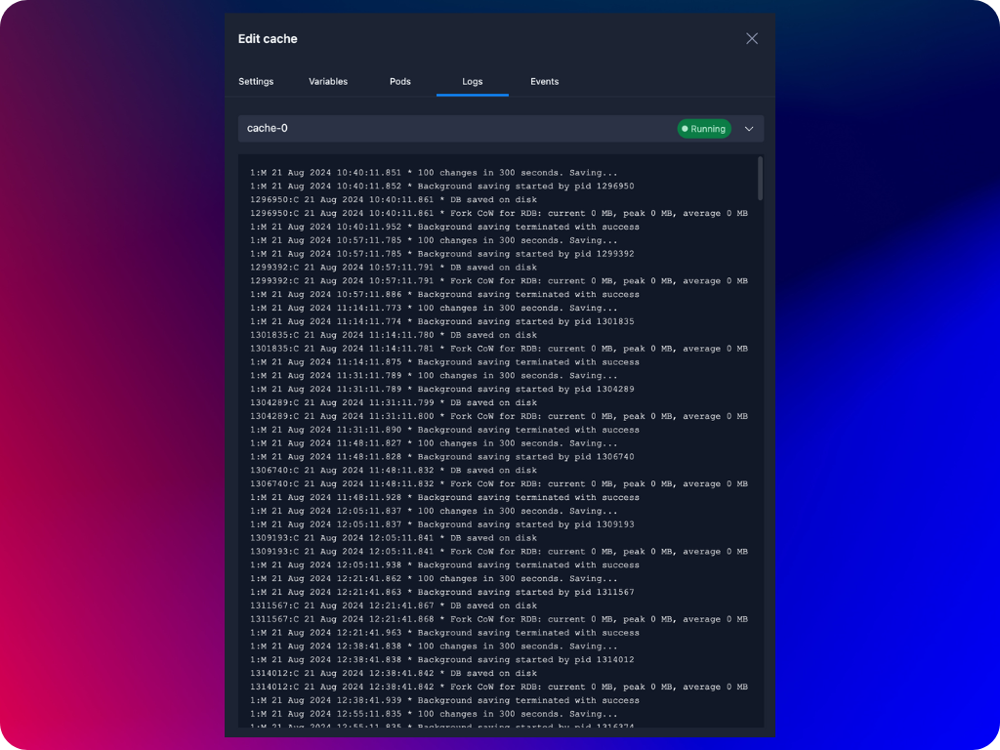
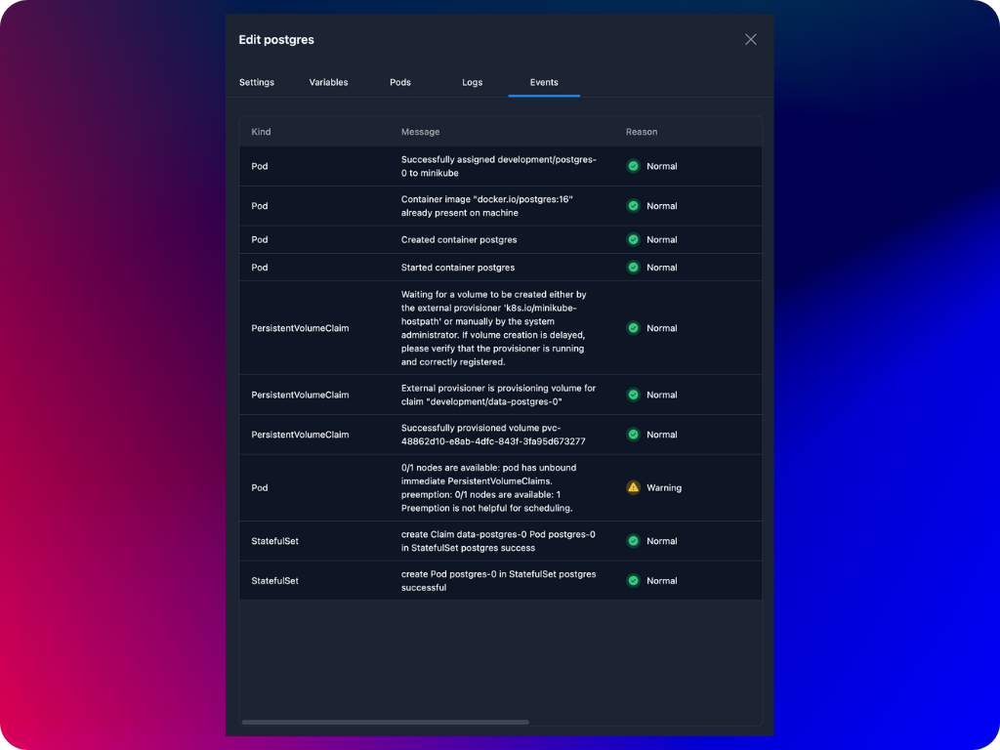

## View Container Pod Logs
You can view the logs generated by a container pod. These logs are essentially the output that your application writes to the console, which can include things like error messages, status updates, or any other information the application is programmed to log. The primary purpose of logs is to help you troubleshoot and monitor your application. By viewing the logs, you can gain insights into the behavior of your application, identify problems, and verify that your application is running as expected.

:::note
Please note that Agnost shows only the last 500 lines of container pod logs by default.
:::

## View Container events
You can view container events that have occurred in your Kubernetes cluster. Events are records of significant occurrences within the cluster, such as the scheduling of a container pod, a pod crash, or issues with network connectivity. These events provide insight into what is happening in the cluster and can be crucial for troubleshooting and understanding the state of your resources.

