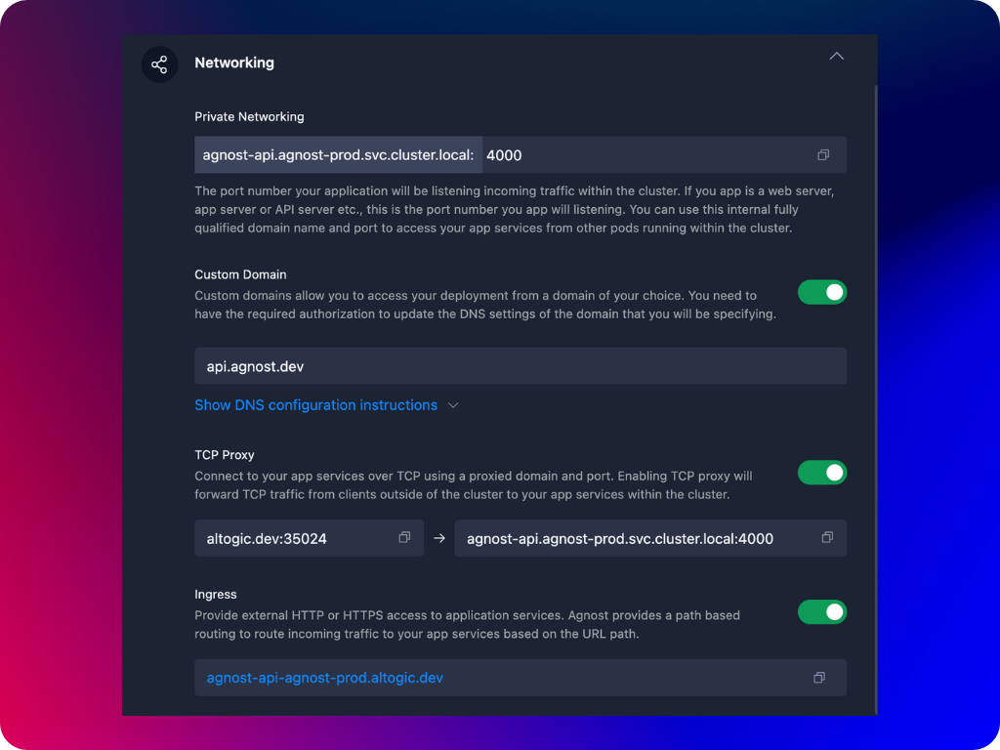

Agnost provides several networking options for your containers (deployments and stateful sets), which you can use to access your container services internally and externally.

- **Private Networking (within Kubernetes Cluster):** Private networking in Agnost refers to the internal network that connects all the container pods within a cluster. This network is isolated from external networks, meaning only services and pods within the cluster can communicate over this network. For example, when multiple microservices need to communicate securely within the cluster, private networking ensures they can do so without exposing the traffic to the outside world, maintaining security and reducing latency.
- **Custom Domain:** Custom domain networking in Agnost allows you to map a domain name (e.g., myapp.com) to a container running in your Kubernetes cluster. This makes it easier for users to access your services using memorable and brand-specific URLs. You can route traffic to your services based on these custom domain names by configuring DNS records. Suppose you’re hosting a web application in your Kubernetes cluster. In that case, you can configure a custom domain like myapp.com to point to your Ingress, enabling users to access your application using that domain.
- **TCP Proxying:** TCP proxying is a networking solution that allows you to route TCP traffic to specific containers within your Agnost cluster. Unlike HTTP/HTTPS traffic handled by Ingress, TCP proxying deals with raw TCP connections, making it suitable for applications that require non-HTTP protocols, such as databases, SSH, or other custom TCP-based services. A TCP proxy listens on a specific port and forwards the incoming connections to the appropriate container service in the cluster. Suppose you’re running a database service within your Kubernetes cluster and need to allow external clients to connect over TCP. You can set up TCP proxying to route those connections to the database service.
- **Ingress:** Ingress is a Kubernetes resource that manages external access to services inside your Kubernetes cluster. It acts as a reverse proxy, routing HTTP and HTTPS traffic from outside the cluster to the appropriate services within the cluster. Ingress controllers implement the rules defined in Ingress resources, such as hostnames and TLS certificates, allowing you to expose multiple services under a single IP address and domain name. If you enable ingress for your container, Agnost automatically creates a subdomain-based ingress rule and issues the required TLS certificates to securely access your container services through this subdomain-based hostname.

