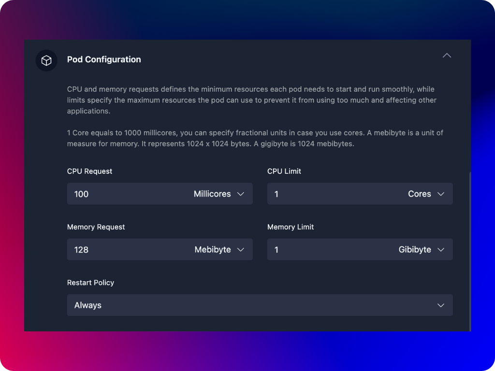

CPU and memory requests and limits are mechanisms used to manage the resources (like CPU and memory) that a pod of your container can use on a node. These settings help ensure that applications run smoothly without hogging all the resources or getting starved by others.

Requests are the minimum amount of CPU and memory that a pod needs to run. When you set a request, you're telling Kubernetes, "This pod needs at least this much CPU and memory to work properly." Kubernetes uses the request value to decide where to place the pod on a node. It tries to make sure there's enough capacity available to meet the request. If a pod requests 100m CPU (which is 0.1 of a CPU core) and 200Mi of memory, Kubernetes will try to place it on a node that has at least 0.1 CPU and 200Mi of memory available.

Limits are the maximum amount of CPU and memory that a pod is allowed to use. Setting a limit tells Kubernetes, "This pod should not use more than this much CPU and memory." If the pod tries to use more CPU or memory than its limit: 
- For CPU, it will be throttled (slowed down) so it doesn't exceed the limit. 
- For memory, if it tries to use more than the limit, the pod will be terminated (killed) by Kubernetes, and it might be restarted.

You can configure the following resource request and limit values for your container pods.

