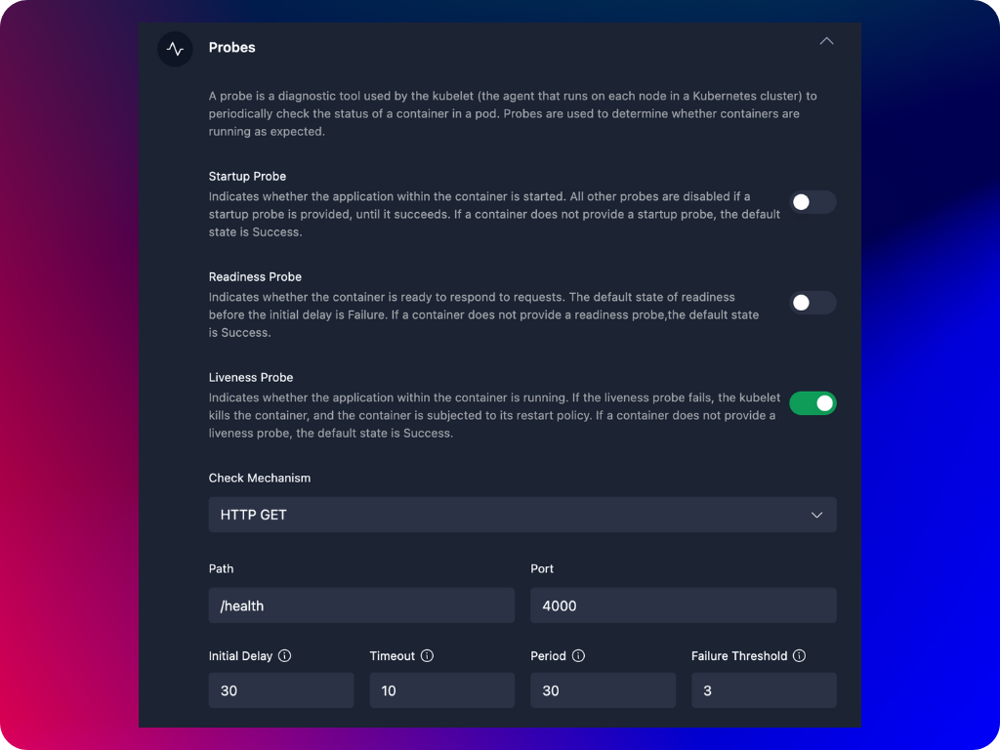

**Startup, readiness, and liveness probes** are health checks that help ensure your container pods are working correctly. Each probe serves a different purpose in managing the lifecycle of your container. Here's a simple explanation of each:
- **Startup Probe:** Checks if your application has started successfully. When a container pod is created, the startup probe ensures that your application has fully started before Kubernetes starts checking other probes (like readiness and liveness). This is useful for applications that take a long time to start. If the startup probe fails, Kubernetes will keep restarting the container pod until the probe succeeds. Once the startup probe passes, Kubernetes assumes your application is up and running.
- **Readiness Probe:** Checks if your application is ready to accept traffic. Kubernetes uses the readiness probe to determine if a container pod should be part of the service's load balancer. If the probe fails, the pod will not receive any traffic until it passes the readiness check. If the readiness probe fails, Kubernetes removes the pod from the list of available endpoints, so no traffic is sent to it until it passes the probe again.
- **Liveness Probe:** Checks if your container is still running and healthy. The liveness probe continuously monitors your container pods to ensure they are running properly. If the liveness probe fails, it means the pod is not healthy (maybe it's stuck or crashed), and Kubernetes will restart the pod to try to recover it. If the liveness probe fails, Kubernetes will kill the pod and create a new one to replace it.

