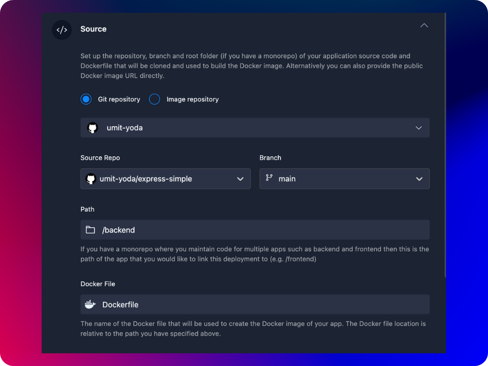

You can have two source options in Agnost which define how the image of your container will be procured.
- **Git Repository** defines the git provider account, the repository, branch, dockerfile path and name.
- **Image Repository** defines the URL of any publicly accessible image repository e.g., Docker Hub, Quay 

When linking your container to a branch in your git repository you need to set the following parameters.

- **Git Provider:** You can either select your GitHub, GitLab or Bitbucket account.
- **Source Repo:** As its name implies, when you select your git provider your source repos will be automatically fetched and displayed. 
:::note
Please note that only repositories where you have admin rights to create a webhook will be displayed in the source repo list.
:::
- **Branch:** The list of branches assocated with the selected repository
- **Path:** The path to your dockerfile. If the dockerfile is a the root of your repo you can keep the default value of `/`. This path will also be used as the docker context when building the image, meaning that your application source or configuration files should be relative this path.
- **Dockerfile:** The name of the dockerfile. By default Agnost uses `Dockerfile`, if you have a different dockerfile for development or production, you need to specify the exact name of the dockerfile in this field. 