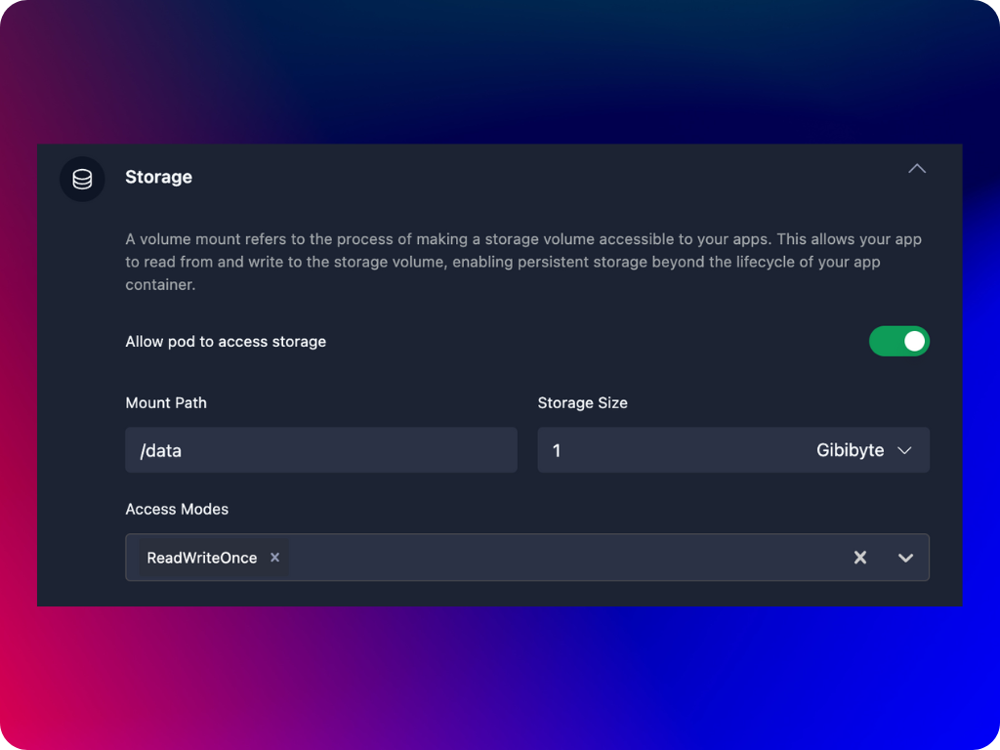

Storage in Kubernetes is like a storage room or a disk where your application can save files, logs, databases, or any data it needs to keep. This storage is independent of the containers, meaning even if the container stops or restarts, the data remains safe. For example, imagine you have a web application that saves user-uploaded images. These images need to be stored somewhere so that even if the web server restarts, the images are not lost.

A volume mount is like a doorway that connects your storage room (the storage) to your container. When you mount a volume, you're telling Kubernetes to make a specific part of your storage accessible inside your container at a specific location (a folder or directory). You might mount a volume at `/uploads` for your web application, so when a user uploads an image, it gets saved in this `/uploads` directory. The images remain even if the web server restarts because they are stored in the mounted volume.

:::note
If a storage is configured with a `ReadWriteOnce` access mode, it means that the volume can be mounted as read-write by only one node at a time. Consequently, only one pod within a deployment can access the storage simultaneously. This restriction is important when dealing with stateful applications where data consistency and integrity are critical, as multiple pods attempting to write to the same volume could cause conflicts or data corruption. If multiple pods need to access the same volume concurrently, a different access mode, such as `ReadWriteMany`, should be used, though this requires a storage backend that supports it. 

If you Kubernetes cluster does not support `ReadWriteMany` storage mode, you can use an object-storage solution like [Minio](https://min.io/), when you need to access storage from multiple pods. Agnost provides a built-in templete to easily create Minio object-storate in your Kubernetes cluster.
:::

