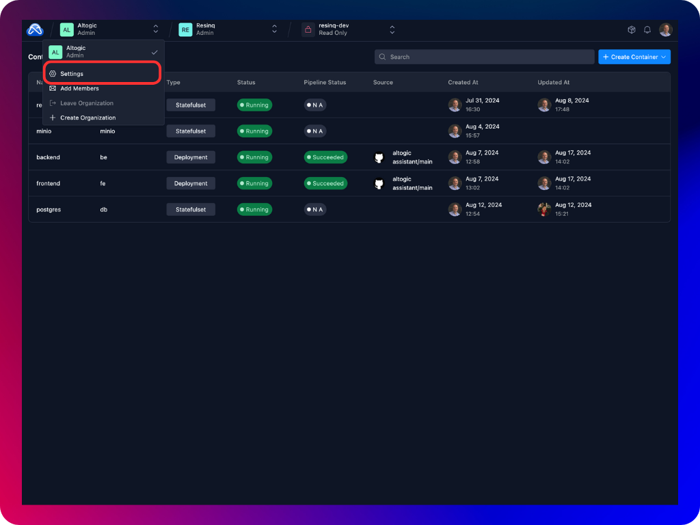
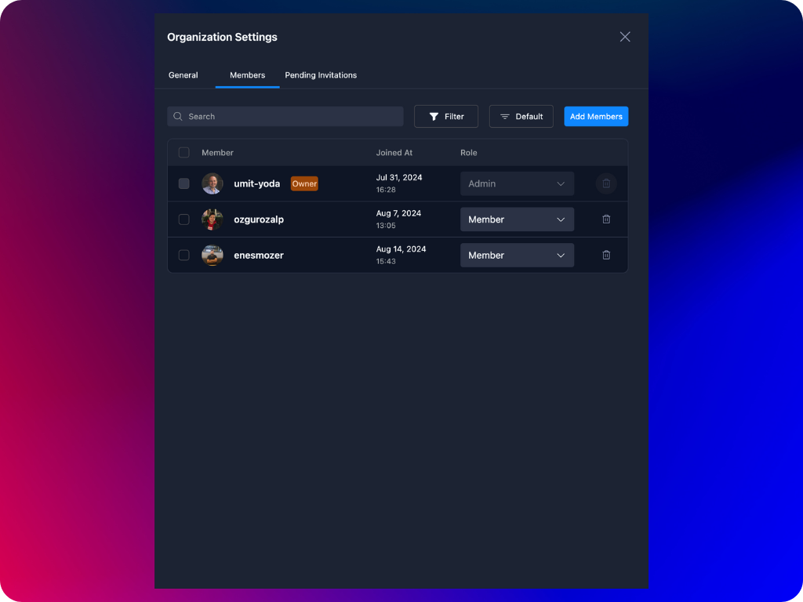
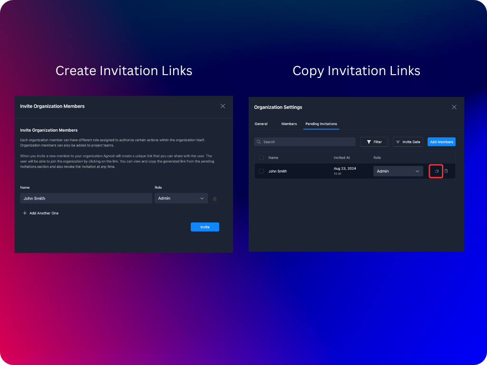
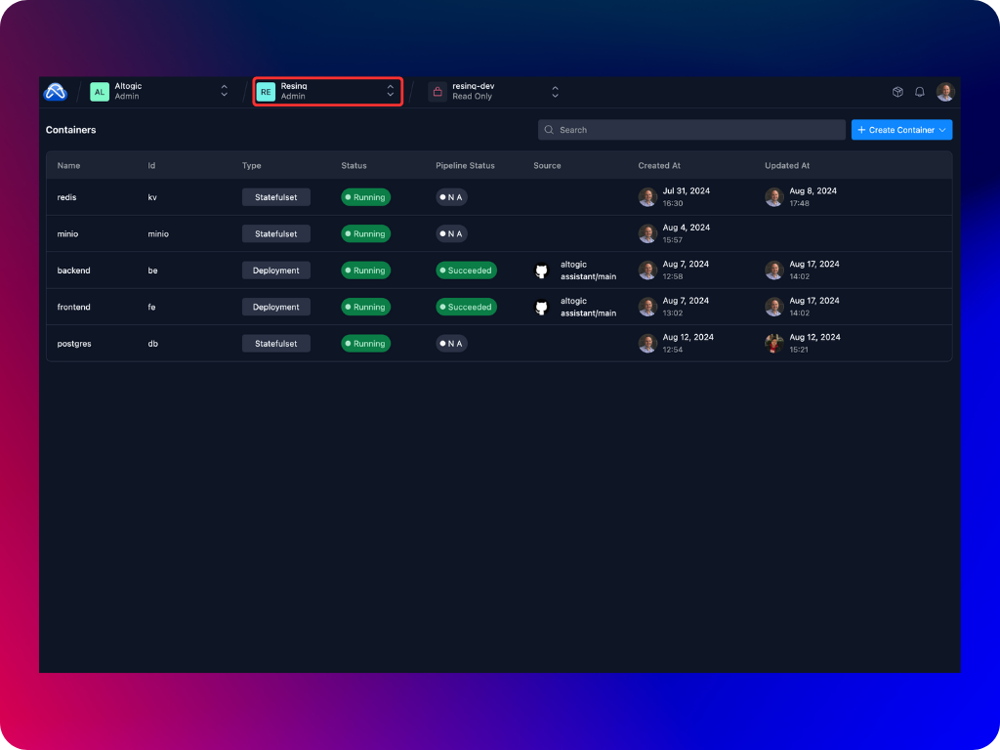
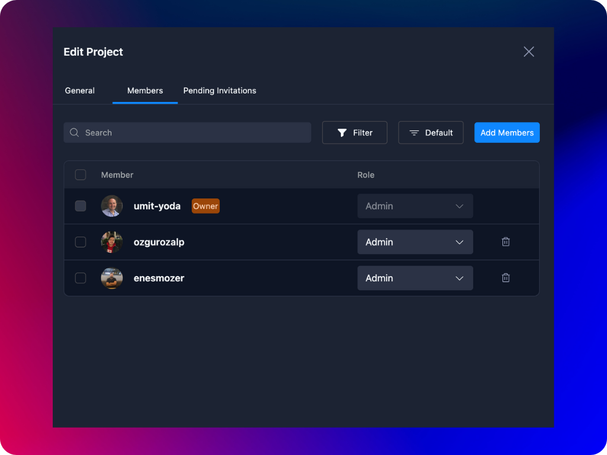
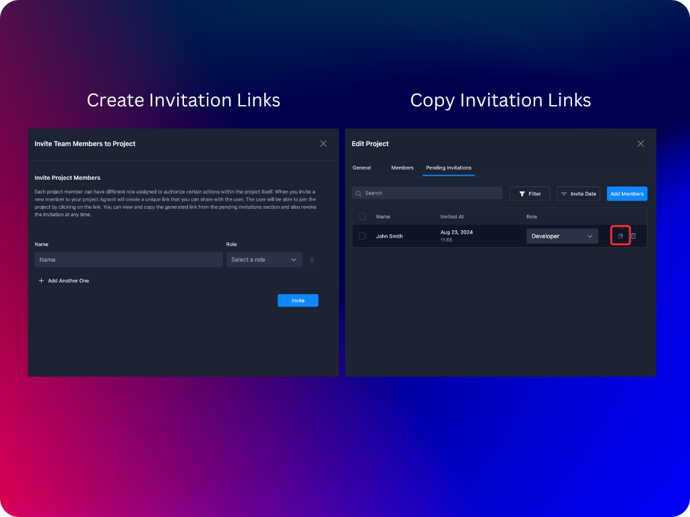
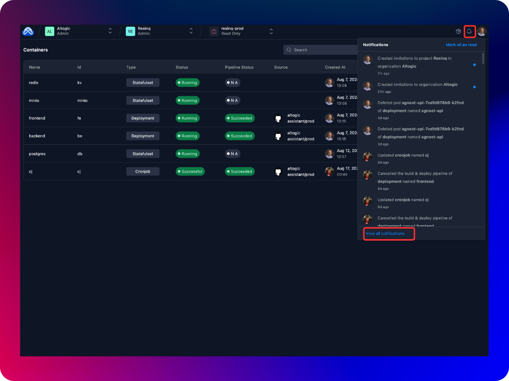
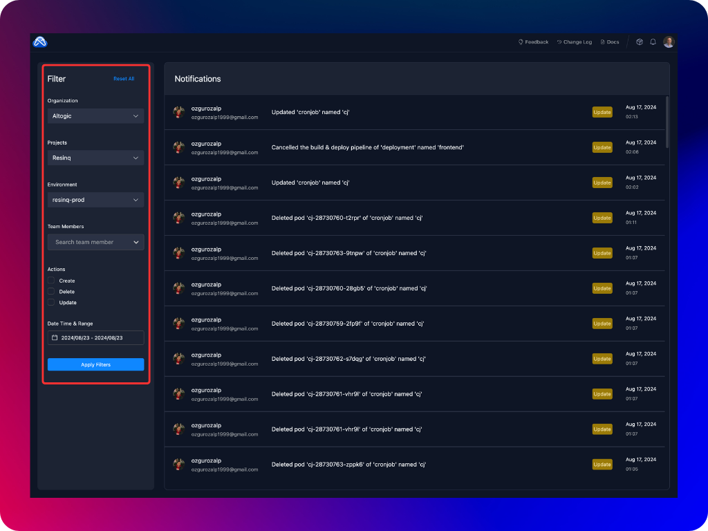

Agnost includes robust team management features to help you manage organizations and projects effectively. This section outlines the roles and permissions for the organization and project members. By defining clear roles and permissions, the platform ensures that each member of your organization and projects has access to the resources they need while maintaining the necessary controls and oversight.

## Organization Team Management
An organization in the platform can consist of multiple projects and members. Organization management allows you to define roles and permissions for each member, ensuring that responsibilities are clearly defined. There are two roles in an organization team.
1. **Admin:** Admins have full control over the organization, including the ability to manage members, create projects, and even create entirely new organizations.
    - Manage organization members (add, remove, and update roles).
    - Create new projects within the organization.
    - Create new organizations.
2. **Member**: Members have limited permissions within the organization. They can view details about the organization and its projects but cannot make changes to membership or create new projects.
    - View organization members.
    - View projects within the organization.

To manage organization team and invite new team members you can navigate to **Organization Settings**.

From **Members** tab, you can view and manage the organization members, change their roles, invite new members and delete existing ones.

To invite a new member, click on **Add Members** button and fill in the required parameters. Agnost will generate a unique invitation link. You can copy and share this link with the user so that they can create their accounts in your Agnost cluster.

:::note
Please note that organization invitation links can be used only once. In order for an organization invitation link to work, your Agnost cluter needs to be publicly accessible, namely you need to set the doman name of your cluster. Please see [Post-Installation](../set-up/customization) configuration steps for more information on how to set your cluster domain.
:::

## Project Team Management
Within each organization, projects can be managed by assigning different roles to project members. The platform supports three distinct roles within a project, each with varying levels of access and control.

1. **Admin:** Project Admins have comprehensive control over the project, including the ability to manage environments, containers, and project members.
    - Full control over the project, including managing project members (add, remove, and update roles).
    - Create, update, and delete environments and containers.
    - View all project details and activities.
2. **Developer:** Developers can manage environments and containers within the project but do not have the authority to manage project membership.
    - Create new environments and containers.
    - Update existing environments and containers.
    - View all project details and activities.
    - Cannot manage project members.
3. **Viewer:** Viewers have the most limited access, allowing them to view project details without making any changes.
    - Read-only access to the project.
    - View all project details and activities.
    - Cannot create or update environments or containers.
    - Cannot manage project members.

To manage project team and invite new team members, you can navigate to **Project Settings**. Click on the project name in Agnost Studio header.

From **Members** tab, you can view and manage the project members, change their roles, invite new members and delete existing ones.

To invite a new member, click on **Add Members** button and fill in the required parameters. Agnost will generate a unique invitation link. You can copy and share this link with the user so that they can create their accounts in your Agnost cluster.

:::note
Please note that project invitation links can be used only once. In order for an project invitation link to work, your Agnost cluter needs to be publicly accessible, namely you need to set the doman name of your cluster. Please see [Post-Installation](../set-up/customization) configuration steps for more information on how to set your cluster domain.
:::

## Review Activity Logs
Agnost provides a comprehensive activity logging feature that allows users to monitor and review actions taken across the system. This section will guide you on how to effectively use the activity logs to keep track of changes and events within your organization and projects.

To access the activity logs:

1. Navigate to the Activity Logs section from the Agnost Studio header.
2. Select the scope of logs you want to review: Organization, Project, or Environment.
3. The activity logs for the selected scope will be displayed, showing a chronological list of actions taken by various team members.

To make it easier to find specific actions or events, the platform allows you to filter activity logs by organization, project, environment, team member, action type and start-end date. The activity logs feature is an essential tool for maintaining transparency and accountability within your organization and projects. By using the filtering options and reviewing log details, you can effectively monitor and audit actions taken across the platform, ensuring that all activities are properly tracked and managed.

