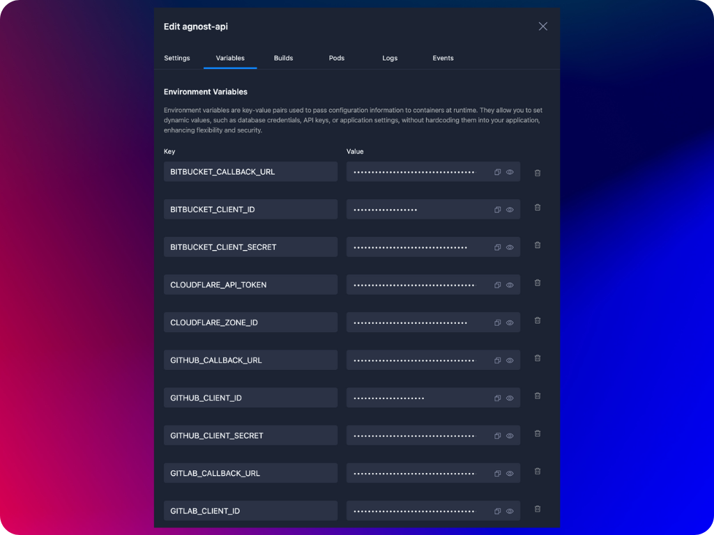

Environment variables are key-value pairs, where each "key" has a corresponding "value." They are set in the environment where your container runs and can be accessed by the container pod just like a variable in programming. They allow you to configure your application without changing its code. Instead of hardcoding settings like database addresses, API keys, or other configuration details directly into your application, you can use environment variables to provide this information.

When you define a container, you can specify environment variables that will be available to the containers pods.

