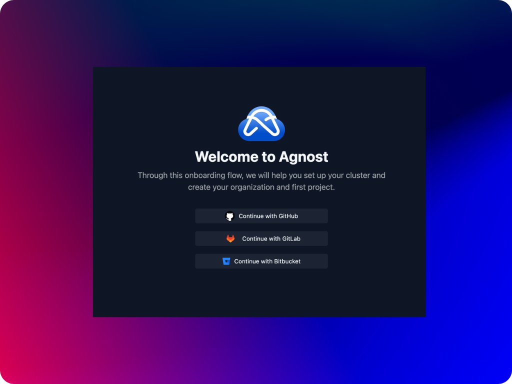
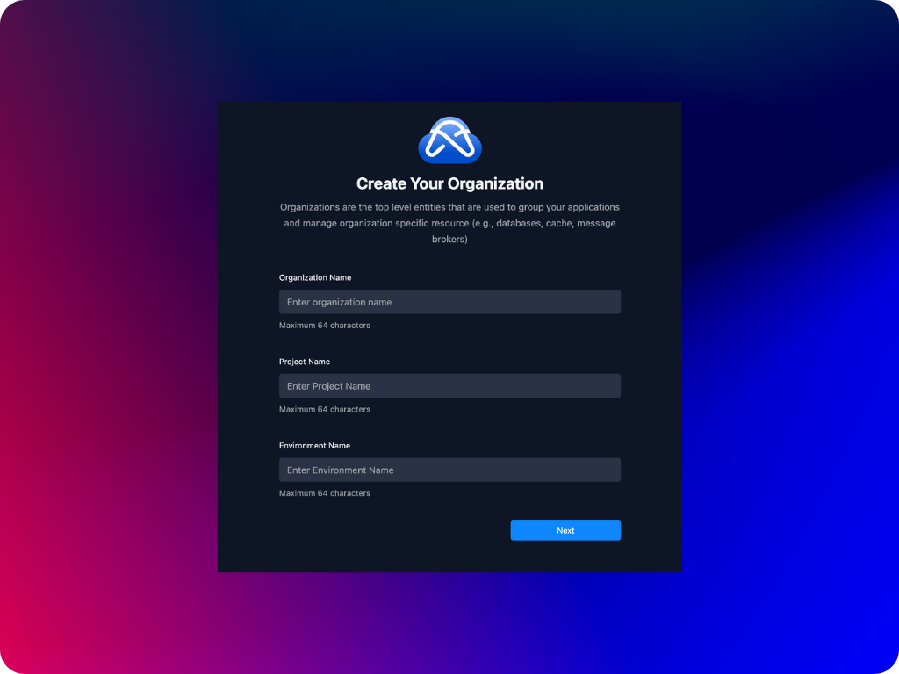
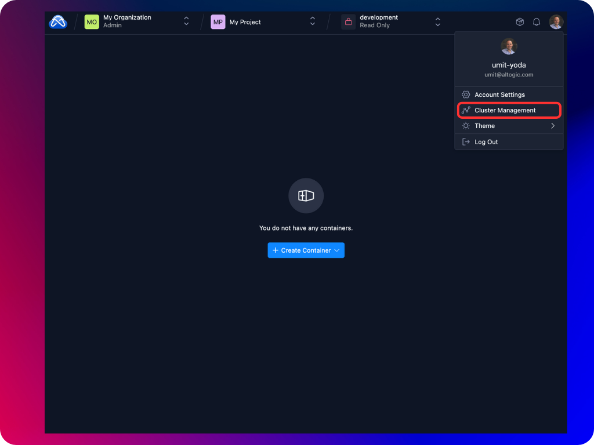
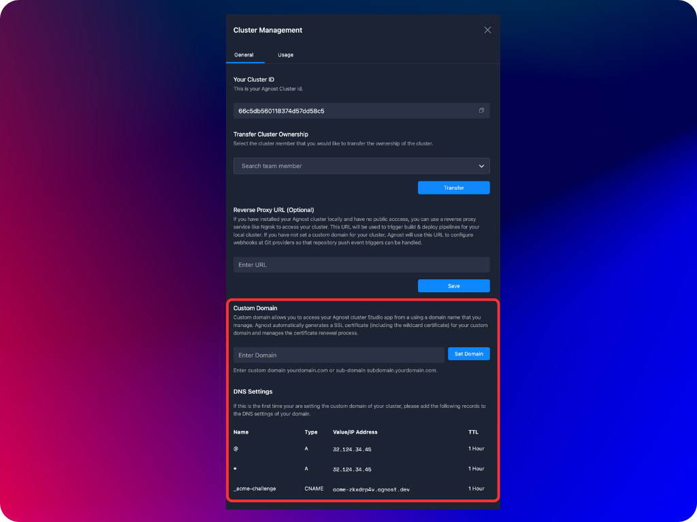
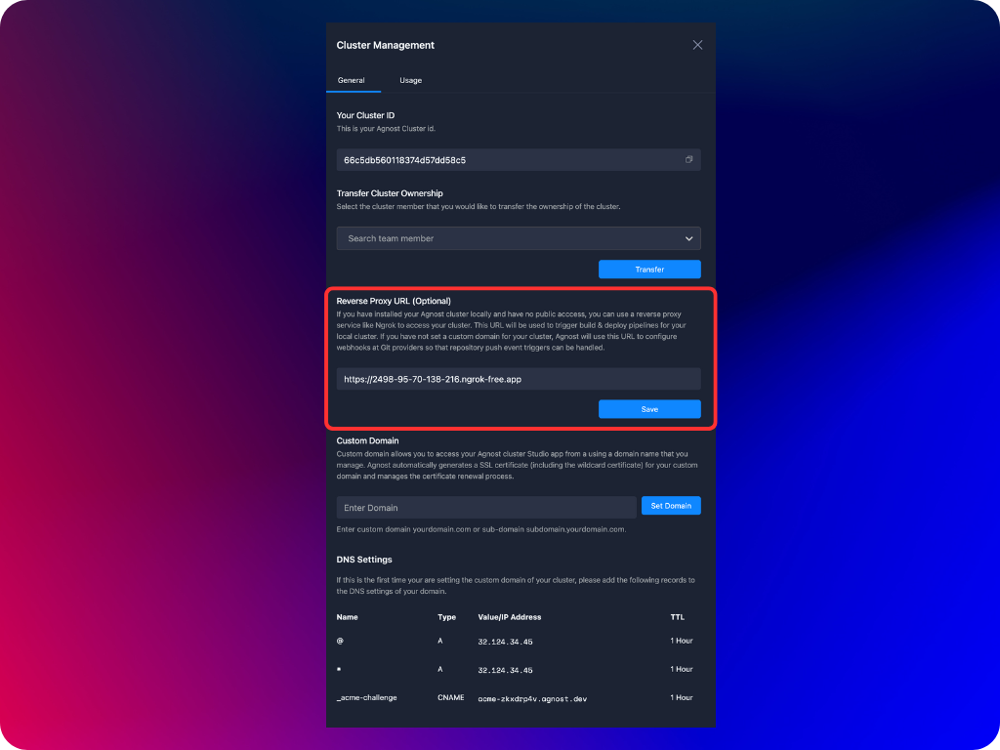

After installing Agnost to your Kubernetes cluster, the next step is to set up and customize the Agnost installation. You need to craate the cluster owner account and set the cluter domain. Please follow the steps below for finalize your cluster setup.

## Create Cluster Owner Account
The first step in finalizing your Agnost cluster setup is creating the cluster owner account. Cluster owner is the superuser of the Agnost cluster who has full control over the cluster.

:::note
Please note that cluster owner role can later be transferred to another Agnost cluster user.
:::

1. **Navigate to Agnost Studio.** To launch Agnost Studio, type the URL or IP address of your cluster on your browser e.g., `http(s)://[your cluster URL or IP]/studio`. If you have installed Agnost locally you can access Agnost Studio at http://localhost/studio

2. **Sign up.** Select the git provider account and follow the OAuth flow of your selected git provider to create your cluster owner user account. 
3. **Create you first project.** Create your first organization, project and environment by filling in the required input parameters. 

After you click on the next button your initial organization, project and its environment will be created and you will be directed to the containers list page. That is all required to create the cluster owner account. In the next step you need to set the domain name of your cluster so that you can connect to Agnost Studio through `https://[your_domain]` instead of http://localhost/studio

:::caution
Unless you set either the reverse proxy URL or the cluster domain, you will not be able to create containers that are connected to your git repositories.
:::

## Set Cluster Domain
Following the creation of the cluster owner account, you need to set the domain name of your cluster. A domain name needs to be specified for your cluster to not only enable external access to it but also for enabling ingress and registering webhooks to listen git repository push events.

:::note
**Please note that your Kubernetes cluster needs be be publicly accessible through an IP number or DNS hostname in order to set its domain name**. If you have installed your Kubernetes cluster on your local computer, most probably your IP number will not be publicly accessible. You can still continue using Agnost in your local Kubernetes cluster, however in order for git providers to call build & deploy webhooks in your cluster you need to have a revese proxy service. You can use a reverse proxy service like [Ngrok](https://ngrok.com/) to access your cluster. This URL will be used to trigger build & deploy pipelines for your local cluster. 
:::

1. **Navigate to cluster management.** To set the domain name of your cluster you first need to navigate to the cluster management settings.

1. **Set cluster domain.** At the cluster management drawer, please set your domain name for your cluster. Please note that you need to have the required access rights to manage DNS records of this domain.

:::note
Agnost automatically issues the certificates for your cluster domain. One certificate for the domain itself and the other for the first-level wildcard subdomains. The subdomain wildcard certificate is issued so that when you create your containers and prefer to expose them to the outside world these containers can be accessed by the automatically generated ingress at `https://[your-container-id]-[environment-id].[your-domain]`
:::

## Set Reverse Proxy URL (optional)
If you have installed your Agnost cluster locally and have no public acccess, you can use a reverse proxy service like [Ngrok](https://ngrok.com/) to access your cluster. This URL will be used to trigger build & deploy pipelines for your local cluster. If you have not set a custom domain for your cluster, Agnost will use this URL to configure webhooks at Git providers so that repository push event triggers can be handled.

